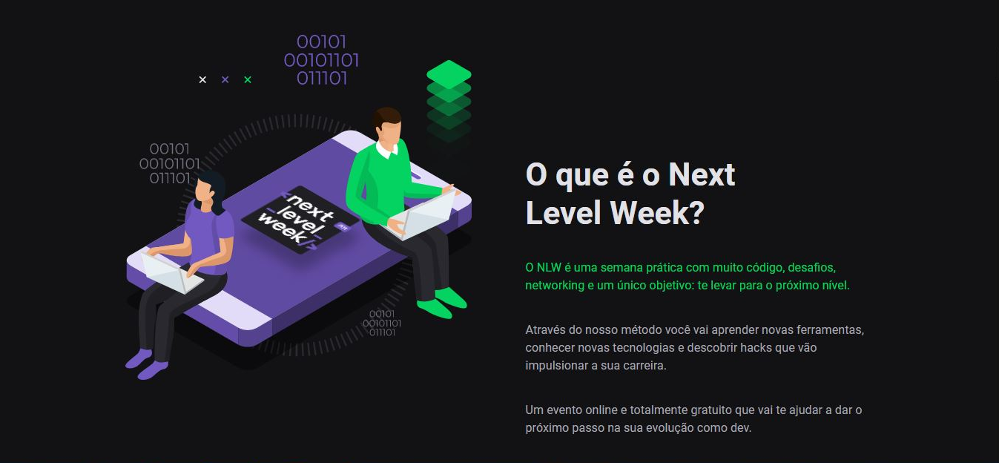
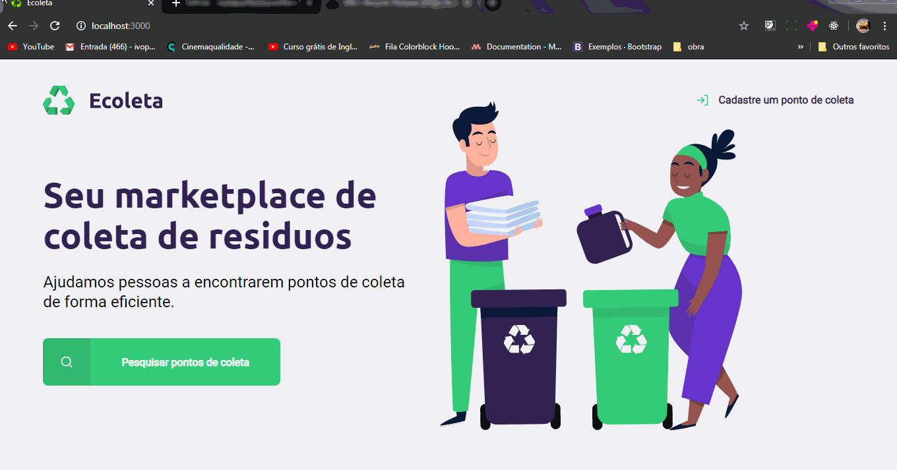
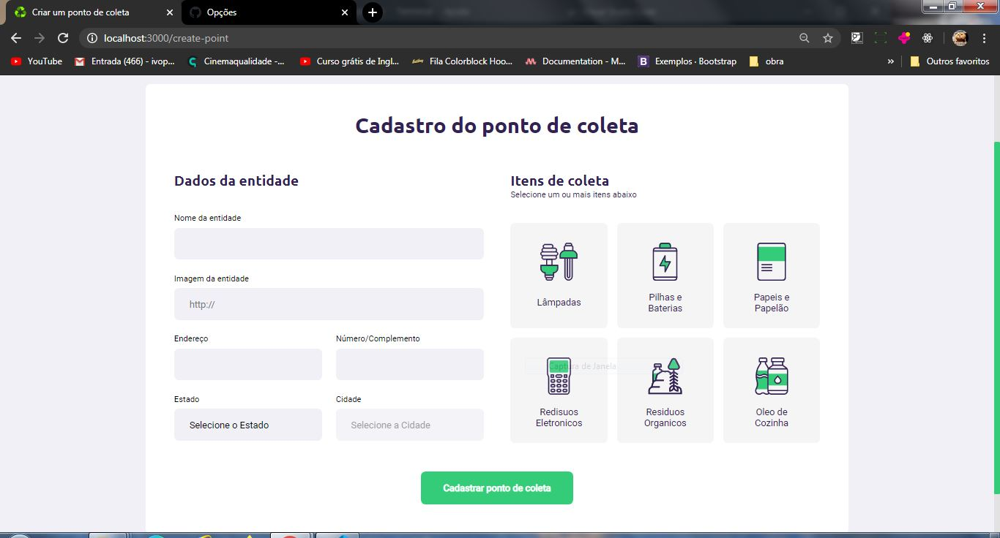
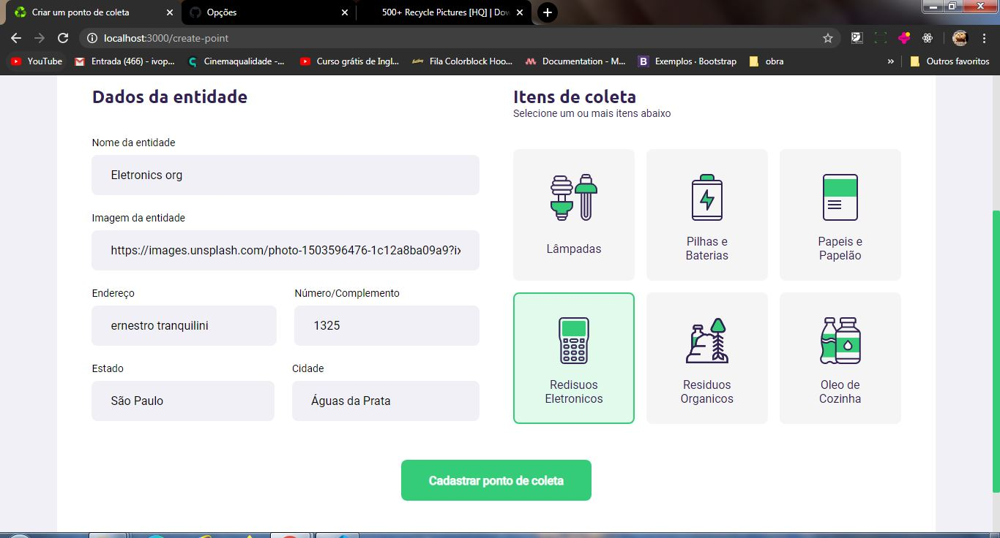
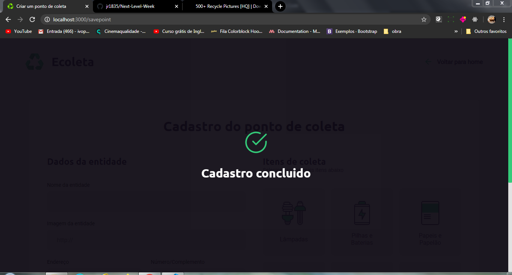

<h3 align="center">
<b>Semana Next level week <p><a href="https://rocketseat.com.br"></a></p></b>
</h3>
</br>

      
   
------------------
</br>

<h4 align="center">
	🚧  Ecoleta Finalizado 🚀🏁
</h4>

<p align="center">
  

  

  
</p>

Tabela de conteúdos
=================
<!-- vscode-markdown-toc -->
* [Sobre o projeto](#Sobreoprojeto)
* [Ecoleta](#Ecoleta)
* [Tecnologias](#Tecnologias)
* [Pré-requisitos](#Pr-requisitos)
* [Como executar o projeto](#Comoexecutaroprojeto)
* [Licença](#Licena)

<!-- vscode-markdown-toc-config
	numbering=true
	autoSave=true
	/vscode-markdown-toc-config -->
<!-- /vscode-markdown-toc -->

## <a name='Sobreoprojeto'></a>ℹ️ Sobre o projeto

O projeto foi ministrado por <a href="https://github.com/maykbrito">Maiky Brito</a>, instrutor da <a href="http://rocketseat.com.br">Rocketseat</a> e foi inspirado por ser a semana do ambiente. Uma semana para descobrir na prática o método que vai acelerar sua evolução e te levar para o próximo nível. 

### Features

- [ ] Cadastro de usuário
- [x] Cadastro de cliente
- [x] Cadastro de produtos

</br>
  
## <a name='Ecoleta'></a>♻  Ecoleta

</br>

  
</br></br>


</br></br>


</br></br>


</br></br>


</br></br>

------------------
</br>
 
## <a name='Tecnologias'></a>🛠️ Tecnologias 

As seguintes ferramentas foram usadas na construção do projeto:

- [CSS](https://developer.mozilla.org/pt-BR/docs/Web/CSS)
- [HTML](https://developer.mozilla.org/pt-BR/docs/Web/HTML)
- [JavaScript](https://www.javascript.com/)
- [Nodejs](https://nodejs.org/en/)

</br>

### <a name='Pr-requisitos'></a> Pré-requisitos

Antes de começar você vai precisar ter o <a href="https://nodejs.org/en/">Nodejs</a> ou instalar ele caso não tenha e também o <a href="https://yarnpkg.com/">Yarn</a>

</br>

## <a name='Comoexecutaroprojeto'></a> ⚙ Como executar o projeto

```bash
# Clone este repositório
$ git clone https://github.com/ivopereira-jr/Next-Level-Week.git

# Instale as dependências
$ yarn

# Execute a aplicação
$ yarn start

# O servidor inciará na porta:3000 - acesse http://localhost:3000
```
</br>

## <a name='Licena'></a> 📝 Licença

Este projeto esta sobe a [Licença MIT](./LICENSE).

Feito com 💜 por Ivo Pereira ✌🏽 [Entre em contato ](https://www.linkedin.com/in/ivopereira-jr/)


