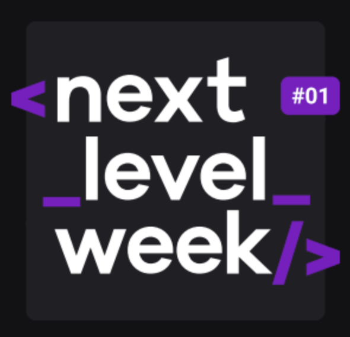

<h3 align="center">
<b>Semana Next level week 

</b>
 
     
</h3></b>  

      
   
------------------
 
📌 Sobre o projeto que foi desenvolvido:

O projeto foi ministrado por <a href="https://github.com/maykbrito">Maiky Brito</a>, instrutor da <a href="http://rocketseat.com.br">Rocketseat</a> e foi inspirado por ser a semana do ambiente. Uma semana para descobrir na prática o método que vai acelerar sua evolução e te levar para o próximo nível. 

 
📌 Ecoleta:
  
  
  

  

  

  

  

------------------
 
 
📌  <strong>Tecnologias utilizadas:</strong>

- Css
- Html
- Javascript
- Node.js
  

💬 Fale comigo
------------------
[*Entre em contato comigo*](https://www.linkedin.com/in/ivo-baptista-3712144/)

Obrigado por chegar até aqui!

